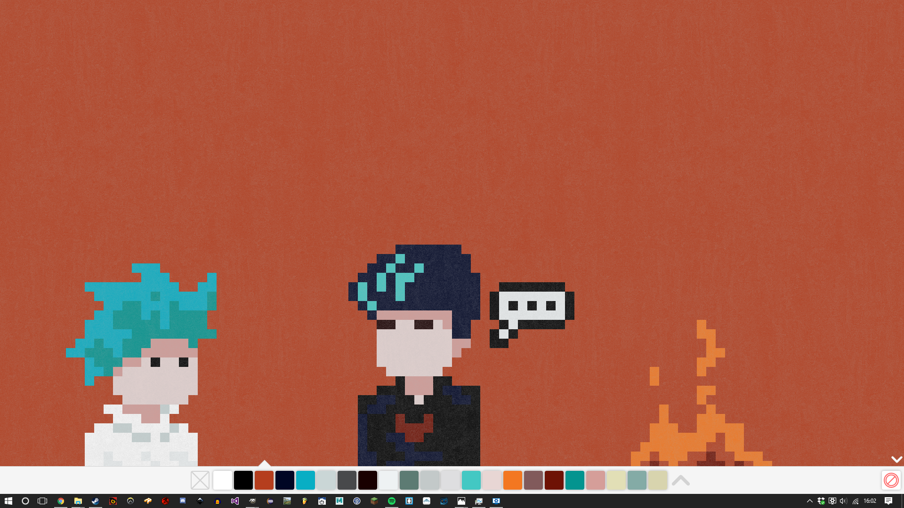
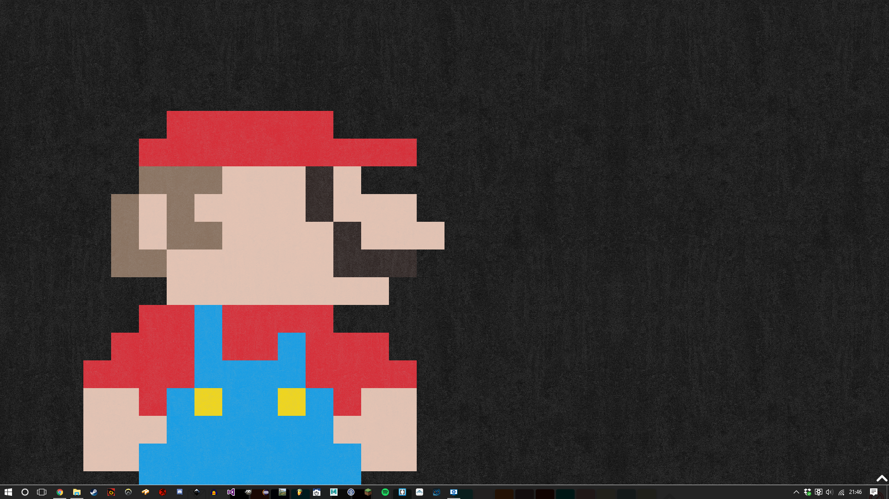
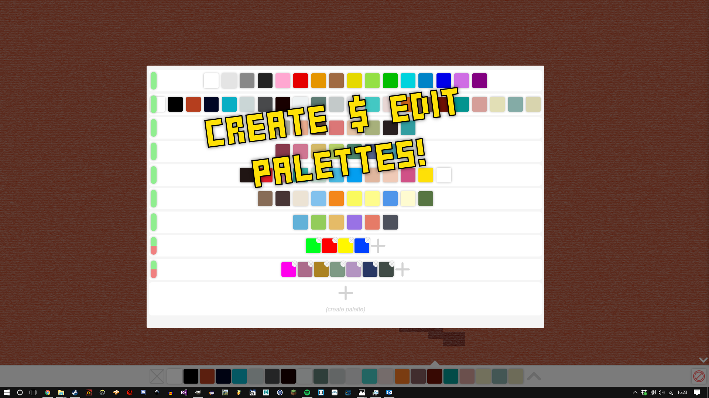
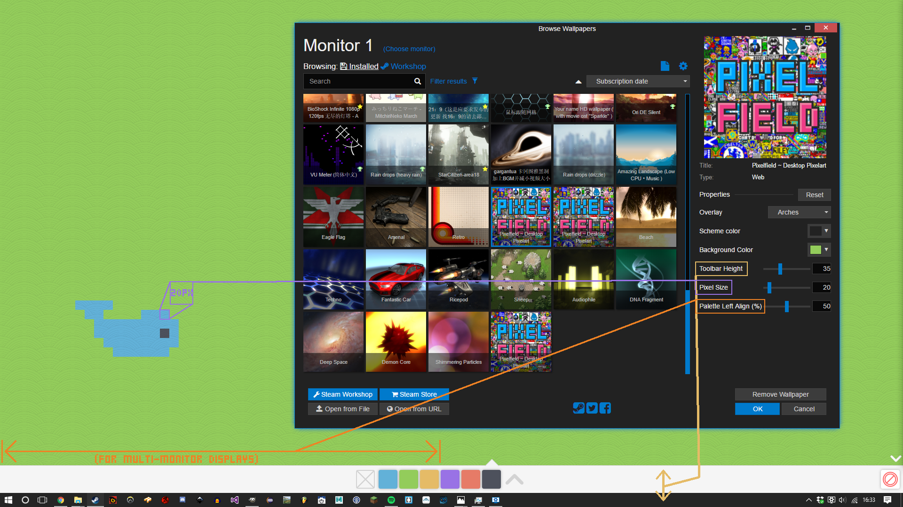
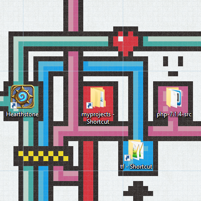

# Pixelfield
## Pixelart editor web app for Wallpaper Engine.

</img> </img> </img> </img> </img> </img> 

### Try it now: https://steamcommunity.com/sharedfiles/filedetails/?id=1397700176
#### In browser: https://jugbot.github.io/Pixelfield/
